# General application flow

The application has three main paths. Each path starts in the frontend, passes through the backend, and returns a clear result.

## 1. A student asks for an exercise

1. The student chooses a level and writes what they want to learn.
2. The frontend sends this request to the main backend.
3. RAG searches the enabled exercises at that level.
4. The LLM receives only the closest exercises and chooses one existing ID.
5. The frontend shows the chosen exercise and the reason for the choice.

If there is no close match, the student receives a simple “no exercise found” response. The LLM cannot create a new exercise.

## 2. A student submits C code

1. The frontend sends the exercise ID and the student's code to the backend.
2. The backend loads the private tests for that exercise.
3. The code checker sends the temporary code to the isolated C runner.
4. The runner compiles it, runs every test, and returns a result.
5. The database saves only the attempt information. The submitted code is discarded.
6. The frontend shows a simple success or failure result.

## 3. An admin manages exercises

The admin page supports only upload, search, reports, and disabling exercises.

For an upload, the backend checks the JSON, tests the reference solution, and creates the RAG vector. The exercise is stored only if every step succeeds.

For an existing exercise, the backend searches the database, loads its reports, or changes its status to `disabled`.

## Information that stays private

- Private tests and expected outputs never go to the student or the LLM.
- Student code is used only while checking one submission.
- The LLM receives public information from a small list of retrieved exercises.
- Browser requests use checked JSON over HTTPS.

## Flow diagram

```mermaid
%%{init: {"theme":"base","themeVariables":{"background":"#fffdf7","primaryTextColor":"#1f2937","lineColor":"#84a98c","clusterBkg":"#f7fee7","clusterBorder":"#86efac"},"flowchart":{"curve":"stepAfter","nodeSpacing":35,"rankSpacing":45}}}%%
flowchart LR
    subgraph Find["FLOW 1 — STUDENT FINDS AN EXERCISE"]
        direction TB
        F1["1. SEND A LEARNING REQUEST<br/>Level + what to practise<br/>(Student)"]
        F2["2. SEND THE REQUEST<br/>Check the form<br/>(Frontend)"]
        F3["3. CHECK THE REQUEST<br/>Confirm login and format<br/>(Main backend)"]
        F4["4. FIND CLOSE EXERCISES<br/>Search enabled exercises<br/>(RAG + PostgreSQL + pgvector)"]
        F5["5. CHOOSE ONE RESULT<br/>Use only a returned exercise ID<br/>(LLM)"]
        F6["6. SHOW THE EXERCISE<br/>Or show that no match exists<br/>(Frontend)"]
        F7["RESULT<br/>The student can start the exercise"]

        F1 --> F2 --> F3 --> F4 --> F5 --> F6 --> F7
    end

    subgraph Submit["FLOW 2 — STUDENT SUBMITS C CODE"]
        direction TB
        S1["1. SUBMIT C CODE<br/>Exercise ID + temporary code<br/>(Student)"]
        S2["2. SEND THE SUBMISSION<br/>Check the form<br/>(Frontend)"]
        S3["3. LOAD PRIVATE TESTS<br/>Prepare the checking request<br/>(Main backend)"]
        S4["4. CHECK THE CODE<br/>Compile, run and compare outputs<br/>(Code checker + isolated runner)"]
        S5[("5. SAVE THE ATTEMPT<br/>Result, attempt number and time<br/>(Database)")]
        S6["6. SHOW THE RESULT<br/>Simple success or failure<br/>(Frontend)"]
        S7["RESULT<br/>The student sees the outcome"]

        S1 --> S2 --> S3 --> S4 --> S5 --> S6 --> S7
    end

    subgraph Manage["FLOW 3 — ADMIN MANAGES EXERCISES"]
        direction TB
        A1["1. CHOOSE AN ACTION<br/>Upload, search, reports or disable<br/>(Admin)"]
        A2["2. SEND THE REQUEST<br/>Use the admin page<br/>(Frontend)"]
        A3["3. CHECK ADMIN ACCESS<br/>Check the request and JSON<br/>(Main backend)"]
        A4["4. COMPLETE THE ACTION<br/>Validate an upload or manage an exercise<br/>(Checker + RAG + backend)"]
        A5[("5. READ OR SAVE<br/>Exercises, vectors and reports<br/>(Database)")]
        A6["6. SHOW THE RESULT<br/>Success, failure, list or reports<br/>(Frontend)"]
        A7["RESULT<br/>The admin sees what happened"]

        A1 --> A2 --> A3 --> A4 --> A5 --> A6 --> A7
    end

    classDef outside fill:#fffbeb,stroke:#fb923c,color:#1f2937,stroke-width:2px;
    classDef work fill:#ecfdf5,stroke:#4ade80,color:#1f2937,stroke-width:2px;
    classDef storage fill:#f0fdf4,stroke:#16a34a,color:#1f2937,stroke-width:2px;
    classDef result fill:#f7fee7,stroke:#15803d,color:#1f2937,stroke-width:2px;

    class F1,S1,A1 outside;
    class F2,F3,F4,F5,F6,S2,S3,S4,S6,A2,A3,A4,A6 work;
    class S5,A5 storage;
    class F7,S7,A7 result;

    style Find fill:#fffdf7,stroke:#86efac,stroke-width:2px,color:#1f2937;
    style Submit fill:#fffdf7,stroke:#86efac,stroke-width:2px,color:#1f2937;
    style Manage fill:#fffdf7,stroke:#86efac,stroke-width:2px,color:#1f2937;

    linkStyle default stroke:#84a98c,stroke-width:2px;
    linkStyle 0,6,12 stroke:#f59e0b,stroke-width:4px;
    linkStyle 5,11,17 stroke:#15803d,stroke-width:4px;
```

## Map key

| Symbol or colour | Meaning |
| --- | --- |
| Pale orange box | A person starts a request |
| Pale green box | A system completes one step |
| Green database shape | Information is stored |
| Dark-green result box | The result leaves the platform flow |
| Orange arrow | The request enters the platform |
| Soft-green arrow | Work continues inside the platform |
| Dark-green arrow | The result is returned |

This is the planned flow. It does not mean the systems are already implemented or that their module points are already earned.
