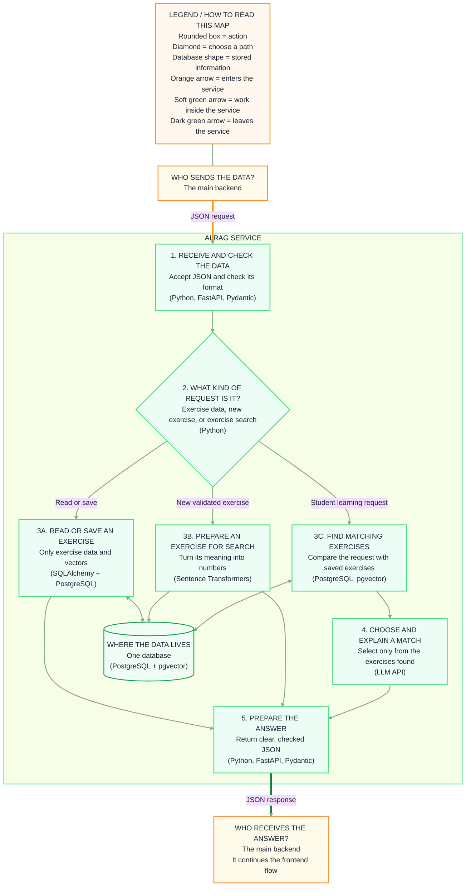

# AI/RAG service

This service starts working when the main backend sends checked JSON. It does not manage pages, accounts, attempts, reports, or C compilation.

## What sends data to me

The **main backend service** sends a JSON request. Depending on the request, the AI/RAG service will:

1. save or retrieve an exercise;
2. prepare a validated exercise for future searches;
3. find an exercise that matches what a student wants to learn.

## Diagram

The AI/RAG service receives these requests through an internal web address (**FastAPI endpoint**). It checks that every required value has the correct format (**Pydantic validation**).

## Case 1: exercise database work

Examples include saving, reading, searching, or disabling an exercise.

The service uses **SQLAlchemy** to work with the exercise table. SQLAlchemy connects to **PostgreSQL** through **Psycopg**.

It returns either the requested data or a clear success or error result as JSON.

## Case 2: a new validated exercise

The main backend sends the exercise only after the reference solution passes the C tests.

The service creates a numerical description of the exercise's meaning (**Sentence Transformers embedding**) and stores it with the exercise. This makes the exercise searchable later (**PostgreSQL with pgvector**).

It returns the exercise ID, title, and whether saving succeeded.

## Case 3: a student wants an exercise

The main backend sends the student's selected level and written request.

The service turns the request into numbers, compares it with saved exercise vectors, and keeps the closest results (**Sentence Transformers and pgvector**). It then asks an AI model to choose from those results and explain the choice (**LLM API**).

The service checks the AI response and returns an existing exercise ID with the explanation. If there is no close match, it returns a normal “not found” response.

## Technologies used by the AI/RAG service

| Technology | Used for |
| --- | --- |
| Python | Controls the exercise database, RAG, and LLM steps |
| FastAPI | Receives JSON requests and returns JSON responses |
| Pydantic | Checks incoming and outgoing data |
| PostgreSQL | Stores exercises and vectors for this service |
| JSONB | Stores lists such as tests, tags, and hints |
| SQLAlchemy | Reads and writes exercise data |
| Alembic | Creates and updates the exercise table |
| Psycopg | Connects SQLAlchemy to PostgreSQL |
| pgvector | Stores vectors and compares their similarity |
| Sentence Transformers | Creates vectors from exercise text and student requests |
| LLM API | Chooses one retrieved exercise and explains why |

[Read the beginner technology guide](../Technology_guide.md).
