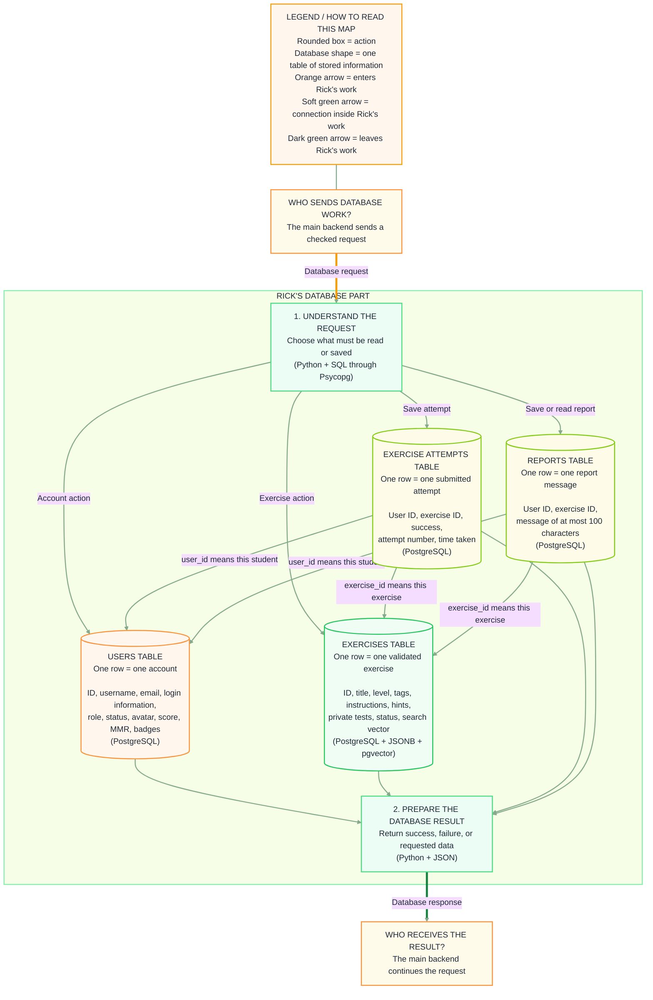

# My database structure

I use one PostgreSQL database. The information is separated into four tables so each type of record has a clear place.

## How a database request moves

1. The main backend sends me a checked request.
2. My Python code decides which table is needed.
3. I read, add, or update a row using SQL.
4. I return the result to the main backend as JSON.

Python communicates with PostgreSQL using **Psycopg**.

## Diagram




## Users table

One row represents one account.

It stores the user ID, username, email, protected login information, role, status, predefined avatar, total score, MMR, and earned badge IDs.

Local accounts have a password hash. GitHub accounts have a GitHub ID instead.

**Technology:** PostgreSQL. Badge IDs are stored as a list (**JSONB**).

## Exercises table

One row represents one exercise that has already passed the tester and vector creation.

It stores the exercise ID, title, type, level, tags, description, starter code, hints, forbidden functions, private tests, status, and vector.

The private tests and vector never go to the student page.

**Technology:** PostgreSQL, **JSONB** for lists and tests, and **pgvector** for the vector.

## Exercise attempts table

One row represents one submitted attempt.

It stores:

- which student submitted it (`user_id`);
- which exercise was submitted (`exercise_id`);
- whether it passed;
- the attempt number;
- the time taken.

The student's code and compiler error are not stored.

**Technology:** PostgreSQL.

## Reports table

One row represents one report message.

It stores the student ID, exercise ID, and a message of at most 100 characters. The username is loaded from the users table when the admin reads reports.

**Technology:** PostgreSQL.

## How the tables connect

The attempt and report tables contain two IDs:

```text
user_id     → identifies one row in the users table
exercise_id → identifies one row in the exercises table
```

This lets several students attempt or report the same exercise without copying the complete user or exercise into every row.

## Common cases

| What happened | Table used |
| --- | --- |
| A student registers | Users |
| A validated exercise is saved | Exercises |
| A student submits code | Exercise attempts |
| A student reports a problem | Reports |
