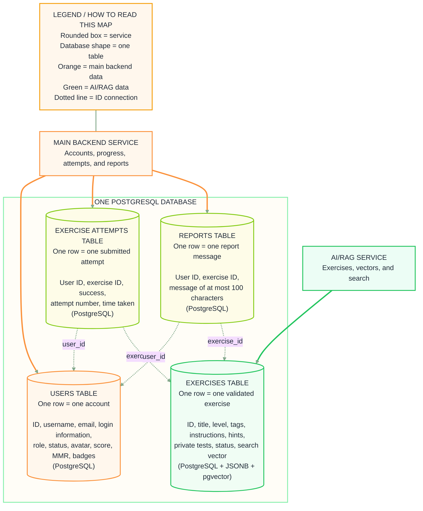

# Database structure and ownership

The platform uses one PostgreSQL database. The information is separated into four tables, and each table has one service responsible for changing it.

## How a database request moves

1. The main backend service reads and changes users, attempts, and reports directly.
2. The AI/RAG service reads and changes exercises and vectors.
3. The services exchange exercise information through REST APIs using JSON.

The AI/RAG service uses **SQLAlchemy**. SQLAlchemy connects to PostgreSQL through **Psycopg**.

## Diagram




## Users table

One row represents one account.

It stores the user ID, username, email, protected login information, role, status, predefined avatar, total score, MMR, and earned badge IDs.

Local accounts have a password hash. GitHub accounts have a GitHub ID instead.

**Technology:** PostgreSQL. Badge IDs are stored as a list (**JSONB**).

**Owner:** Main backend service.

## Exercises table

One row represents one exercise that has already passed the tester and vector creation.

It stores the exercise ID, title, type, level, tags, description, starter code, hints, forbidden functions, private tests, status, and vector.

The private tests and vector never go to the student page.

**Technology:** PostgreSQL, **JSONB** for lists and tests, and **pgvector** for the vector.

**Owner:** AI/RAG service.

## Exercise attempts table

One row represents one submitted attempt.

It stores:

- which student submitted it (`user_id`);
- which exercise was submitted (`exercise_id`);
- whether it passed;
- the attempt number;
- the time taken.

The student's code and compiler error are not stored.

**Technology:** PostgreSQL.

**Owner:** Main backend service.

## Reports table

One row represents one report message.

It stores the student ID, exercise ID, and a message of at most 100 characters. The username is loaded from the users table when the admin reads reports.

**Technology:** PostgreSQL.

**Owner:** Main backend service.

## How the tables connect

The attempt and report tables contain two IDs:

```text
user_id     → identifies one row in the users table
exercise_id → identifies one row in the exercises table
```

This lets several students attempt or report the same exercise without copying the complete user or exercise into every row.

## Common cases

| What happened | Table used | Service responsible |
| --- | --- | --- |
| A student registers | Users | Main backend service |
| A validated exercise is saved | Exercises | AI/RAG service |
| A student submits code | Exercise attempts | Main backend service |
| A student reports a problem | Reports | Main backend service |
