# Saving a new exercise and preparing it for search

This path starts with an admin upload and ends when I save a validated, searchable exercise.

## Before the data reaches me

1. The admin uploads the complete exercise JSON.
2. The main backend checks that its required fields exist and creates the exercise ID.
3. The C tester inserts the reference solution and runs every private test.

If a test fails, the backend rejects the upload. I receive nothing.

## Diagram

```mermaid
%%{init: {"theme":"base","themeVariables":{"background":"#fffdf7","primaryTextColor":"#1f2937","lineColor":"#84a98c","clusterBkg":"#f7fee7","clusterBorder":"#86efac"}}}%%
flowchart TD
    Key["LEGEND / HOW TO READ THIS MAP<br/>Rounded box = action<br/>Diamond = yes-or-no decision<br/>Database shape = stored information<br/>Gray arrow = work before or after Rick<br/>Orange arrow = enters Rick's work<br/>Soft green arrow = work inside Rick's part<br/>Dark green arrow = leaves Rick's work"]

    Admin["BEFORE RICK: ADMIN UPLOAD<br/>The admin sends the complete exercise JSON"]
    Backend["BEFORE RICK: FORMAT CHECK<br/>The main backend checks required fields<br/>and creates the exercise ID"]
    Tester["BEFORE RICK: CODE CHECK<br/>The tester runs the reference solution<br/>(C compiler system)"]
    Passed{"DID EVERY TEST PASS?"}
    Rejected["UPLOAD REJECTED<br/>The backend returns the tester error<br/>Rick receives nothing"]

    subgraph Rick["RICK'S PART: SAVE A SEARCHABLE EXERCISE"]
        Receive["1. RECEIVE THE VALIDATED EXERCISE<br/>Check the received JSON again<br/>(FastAPI + Pydantic)"]
        Sentence["2. CREATE ONE SEARCH SENTENCE<br/>Join title, level, tags, and description<br/>(Python)"]
        Vector["3. TURN THE MEANING INTO NUMBERS<br/>Create the exercise vector<br/>(Sentence Transformers)"]
        VectorOK{"4. WAS THE VECTOR CREATED?"}
        Prepare["5. PREPARE THE FINAL RECORD<br/>Remove the reference solution<br/>add enabled status and the vector<br/>(Python)"]
        Save[("6. SAVE THE EXERCISE<br/>Lists use JSONB; vector uses pgvector<br/>(Psycopg + SQL + PostgreSQL)")]
        Success["7. PREPARE A SUCCESS ANSWER<br/>{ success, exercise_id, exercise_title }<br/>(FastAPI JSON response)"]
        VectorError["VECTOR CREATION FAILED<br/>Save nothing and prepare an error<br/>(FastAPI JSON response)"]
    end

    Receiver["AFTER RICK: MAIN BACKEND<br/>Receives the success or error response"]

    Key ~~~ Admin
    Admin --> Backend
    Backend --> Tester
    Tester --> Passed
    Passed -->|"No"| Rejected
    Passed -->|"Yes: validated exercise JSON"| Receive
    Receive --> Sentence
    Sentence --> Vector
    Vector --> VectorOK
    VectorOK -->|"No"| VectorError
    VectorOK -->|"Yes"| Prepare
    Prepare --> Save
    Save --> Success
    Success -->|"Success JSON"| Receiver
    VectorError -->|"Error JSON"| Receiver

    classDef note fill:#fff7ed,stroke:#f59e0b,color:#1f2937,stroke-width:2px;
    classDef outside fill:#fffbeb,stroke:#fb923c,color:#1f2937,stroke-width:2px;
    classDef work fill:#ecfdf5,stroke:#4ade80,color:#1f2937,stroke-width:2px;
    classDef storage fill:#f0fdf4,stroke:#16a34a,color:#1f2937,stroke-width:2px;
    classDef decision fill:#fefce8,stroke:#84cc16,color:#1f2937,stroke-width:2px;
    classDef error fill:#fff1f2,stroke:#fb7185,color:#1f2937,stroke-width:2px;
    class Key note;
    class Admin,Backend,Tester,Receiver outside;
    class Receive,Sentence,Vector,Prepare,Success work;
    class Save storage;
    class Passed,VectorOK decision;
    class Rejected,VectorError error;
    style Rick fill:#f7fee7,stroke:#86efac,stroke-width:2px,color:#1f2937;

    linkStyle default stroke:#84a98c,stroke-width:2px;
    linkStyle 1,2,3,4 stroke:#94a3b8,stroke-width:2px;
    linkStyle 5 stroke:#f59e0b,stroke-width:4px;
    linkStyle 13,14 stroke:#15803d,stroke-width:4px;
```




## 1. Receive the validated exercise

If all C tests pass, the main backend sends me the validated exercise as JSON.

I receive fields such as its ID, title, type, level, tags, description, starter code, hints, forbidden functions, and private tests.

I check the JSON again before using it (**FastAPI and Pydantic**).

## 2. Create the text used for searching

I combine only the information that describes what the exercise teaches:

```text
Title + level + tags + description
```

I do not include the reference solution, private tests, expected outputs, or hints.

This step uses normal **Python** code.

## 3. Create the vector

I send the search text to an embedding model (**Sentence Transformers**). It returns a list of numbers called a vector.

The vector represents the meaning of the exercise and will later be compared with a student's request.

If vector creation fails, I save nothing and return an error to the main backend.

## 4. Prepare and save the final exercise

I discard the reference solution, add the vector, and set the exercise status to `enabled`.

I save the exercise in **PostgreSQL**:

- normal values use ordinary database columns;
- lists and private tests use **JSONB**;
- the vector uses **pgvector**.

Python sends the database instruction using **Psycopg and SQL**.

## 5. Return the result

After a successful save, I return:

```json
{
  "success": true,
  "exercise_id": "exercise-123",
  "exercise_title": "Create ft_strlen"
}
```

The response is returned through **FastAPI**. If vector creation or saving fails, I return an error and the exercise is not stored.
