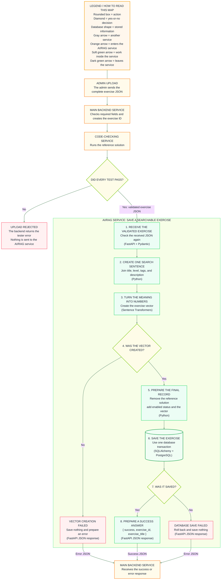

# Saving a new exercise and preparing it for search

This path starts with an admin upload and ends when the AI/RAG service saves a validated, searchable exercise.

## Before the data reaches me

1. The admin uploads the complete exercise JSON.
2. The main backend checks that its required fields exist and creates the exercise ID.
3. The C tester inserts the reference solution and runs every private test.

If a test fails, the main backend rejects the upload. The AI/RAG service receives nothing.

## Diagram




## 1. Receive the validated exercise

If all C tests pass, the main backend sends the validated exercise to the AI/RAG service as JSON.

The AI/RAG service receives fields such as its ID, title, type, level, tags, description, starter code, hints, forbidden functions, and private tests.

It checks the JSON again before using it (**FastAPI and Pydantic**).

## 2. Create the text used for searching

The service combines only the information that describes what the exercise teaches:

```text
Title + level + tags + description
```

It does not include the reference solution, private tests, expected outputs, or hints.

This step uses normal **Python** code.

## 3. Create the vector

The service sends the search text to an embedding model (**Sentence Transformers**). It returns a list of numbers called a vector.

The vector represents the meaning of the exercise and will later be compared with a student's request.

If vector creation fails, the service saves nothing and returns an error to the main backend.

## 4. Prepare and save the final exercise

The service discards the reference solution, adds the vector, and sets the exercise status to `enabled`.

It saves the exercise in **PostgreSQL**:

- normal values use ordinary database columns;
- lists and private tests use **JSONB**;
- the vector uses **pgvector**.

Python saves the exercise using **SQLAlchemy**. SQLAlchemy uses **Psycopg** to connect to PostgreSQL. If saving fails, the transaction is rolled back and no incomplete exercise remains.

## 5. Return the result

After a successful save, the service returns:

```json
{
  "success": true,
  "exercise_id": "exercise-123",
  "exercise_title": "Create ft_strlen"
}
```

The response is returned through **FastAPI**. If vector creation or saving fails, the service returns an error and the exercise is not stored.
