# Finding an exercise with RAG and the LLM

This path starts when a student describes what they want to learn. It ends when I return an existing exercise ID or explain that no suitable exercise exists.

## What I receive

The main backend checks the student's login and sends me:

```json
{
  "level": 2,
  "query": "I want to understand how a function can change the original pointer"
}
```

I receive the JSON through **FastAPI**.

## Diagram

```mermaid
%%{init: {"theme":"base","themeVariables":{"background":"#fffdf7","primaryTextColor":"#1f2937","lineColor":"#84a98c","clusterBkg":"#f7fee7","clusterBorder":"#86efac"}}}%%
flowchart TD
    Key["LEGEND / HOW TO READ THIS MAP<br/>Rounded box = action<br/>Diamond = yes-or-no decision<br/>Database shape = stored information<br/>Gray arrow = work before or after Rick<br/>Orange arrow = enters Rick's work<br/>Soft green arrow = work inside Rick's part<br/>Dark green arrow = leaves Rick's work"]

    Student["BEFORE RICK: STUDENT REQUEST<br/>The student chooses a level and writes<br/>what they want to learn"]
    Backend["BEFORE RICK: MAIN BACKEND<br/>Checks the login and sends<br/>{ level, query }"]

    subgraph Rick["RICK'S PART: FIND AND EXPLAIN AN EXERCISE"]
        Receive["1. RECEIVE THE LEARNING REQUEST<br/>Open the internal request<br/>(FastAPI)"]
        Validate{"2. IS THE REQUEST VALID?<br/>Level is 1-3 and text is acceptable<br/>(Pydantic)"}
        QueryVector["3. TURN THE REQUEST INTO NUMBERS<br/>Create a vector representing its meaning<br/>(Sentence Transformers)"]
        Search["4. SEARCH EXISTING EXERCISES<br/>Same level, enabled status,<br/>and closest vector meanings<br/>(Psycopg + SQL + pgvector)"]
        Candidates["5. KEEP THE BEST RESULTS<br/>Create a short candidate list<br/>(Python)"]
        GoodMatch{"6. IS THE BEST RESULT CLOSE ENOUGH?<br/>Use a minimum similarity score<br/>(Python threshold)"}
        LLMRequest["7. ASK FOR A FINAL CHOICE<br/>Send only public candidate information<br/>(Python LLM library)"]
        LLM["8. CHOOSE AND EXPLAIN<br/>The AI chooses one candidate ID<br/>and writes a short reason<br/>(Configurable LLM API)"]
        Check{"9. IS THE CHOSEN ID ALLOWED?<br/>It must exist in the candidate list<br/>(Pydantic + Python)"}
        Found["10. PREPARE THE MATCH ANSWER<br/>{ matched: true, exercise_id,<br/>exercise_title, reason }<br/>(FastAPI JSON response)"]
        NoMatch["NO SUITABLE EXERCISE<br/>{ matched: false, exercise_id: null,<br/>reason }<br/>(FastAPI JSON response)"]
        Error["CONTROLLED ERROR<br/>Return a safe error message<br/>(FastAPI JSON response)"]
        DB[("WHERE SEARCH DATA LIVES<br/>Enabled exercises and their vectors<br/>(PostgreSQL + pgvector)")]
    end

    Receiver["AFTER RICK: MAIN BACKEND<br/>Receives the match, no-match, or error"]
    Load["AFTER RICK: LOAD THE EXERCISE<br/>The main backend uses the returned ID<br/>and sends public data to the student"]

    Key ~~~ Student
    Student --> Backend
    Backend -->|"{ level, query }"| Receive
    Receive --> Validate
    Validate -->|"No"| Error
    Validate -->|"Yes"| QueryVector
    QueryVector --> Search
    DB -->|"Exercises and vectors"| Search
    Search --> Candidates
    Candidates --> GoodMatch
    GoodMatch -->|"No"| NoMatch
    GoodMatch -->|"Yes"| LLMRequest
    LLMRequest --> LLM
    LLM --> Check
    Check -->|"No"| Error
    Check -->|"Yes"| Found
    Found -->|"Match JSON"| Receiver
    NoMatch -->|"No-match JSON"| Receiver
    Error -->|"Error JSON"| Receiver
    Receiver --> Load
    Load --> Student

    classDef note fill:#fff7ed,stroke:#f59e0b,color:#1f2937,stroke-width:2px;
    classDef outside fill:#fffbeb,stroke:#fb923c,color:#1f2937,stroke-width:2px;
    classDef work fill:#ecfdf5,stroke:#4ade80,color:#1f2937,stroke-width:2px;
    classDef storage fill:#f0fdf4,stroke:#16a34a,color:#1f2937,stroke-width:2px;
    classDef decision fill:#fefce8,stroke:#84cc16,color:#1f2937,stroke-width:2px;
    classDef error fill:#fff1f2,stroke:#fb7185,color:#1f2937,stroke-width:2px;
    class Key note;
    class Student,Backend,Receiver,Load outside;
    class Receive,QueryVector,Search,Candidates,LLMRequest,LLM,Found work;
    class DB storage;
    class Validate,GoodMatch,Check decision;
    class NoMatch,Error error;
    style Rick fill:#f7fee7,stroke:#86efac,stroke-width:2px,color:#1f2937;

    linkStyle default stroke:#84a98c,stroke-width:2px;
    linkStyle 2 stroke:#f59e0b,stroke-width:4px;
    linkStyle 16,17,18 stroke:#15803d,stroke-width:4px;
    linkStyle 1,19,20 stroke:#94a3b8,stroke-width:2px;
```




## 1. Check the request

I verify that the level is `1`, `2`, or `3` and that the written request follows the agreed length and format rules (**Pydantic**).

Invalid requests receive a controlled error.

## 2. Turn the request into a vector

I use the same embedding model used for the exercises (**Sentence Transformers**). It converts the student's sentence into a vector.

Using the same model is necessary because the request vector must be comparable with the exercise vectors.

## 3. Search the exercise library

I search only exercises that:

- are `enabled`;
- have the student's selected level;
- have vectors close to the request vector.

Python sends the search using **Psycopg and SQL**. PostgreSQL compares the vectors using **pgvector**.

I keep a small list of the closest exercises.

## 4. Decide whether there is a real match

The closest result is not automatically a good result. I compare its similarity score with a minimum accepted score.

If it is too low, I return:

```json
{
  "matched": false,
  "exercise_id": null,
  "reason": "No suitable exercise is available for this request."
}
```

The exact minimum score will be decided by testing real requests.

## 5. Ask the LLM to choose

When useful matches exist, I send the LLM only their public information:

- exercise ID;
- title;
- level;
- tags;
- description.

The LLM is instructed to choose one of those IDs and write a short explanation. It cannot generate a new exercise.

This step uses a Python library for the chosen **LLM API**. The provider and model are still to be decided.

## 6. Check and return the answer

I verify that the LLM returned a valid candidate ID (**Pydantic and Python**). An invented or malformed ID becomes a controlled error.

A successful response looks like:

```json
{
  "matched": true,
  "exercise_id": "exercise-123",
  "exercise_title": "Change a pointer from a function",
  "reason": "This exercise practises changing a caller's pointer through a double pointer."
}
```

I return this JSON through **FastAPI**. The main backend then loads the complete exercise and sends its public information to the student.

This completes the RAG path: retrieve relevant exercises first, then generate a grounded explanation from that retrieved information.
